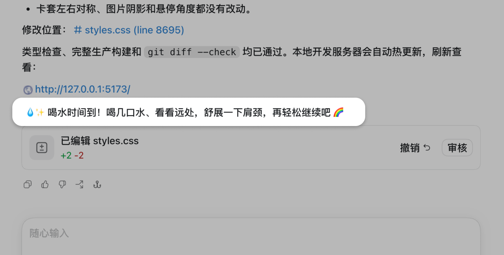

# Gentle Break Reminder

<p align="center">
  
  
</p>

[](https://github.com/SaiSai-me/gentle-break-reminder/releases/tag/v0.1.3)
[](./LICENSE)

一个运行在 Codex 对话里的本地休息提醒插件。

它根据你提交消息的时间和次数，识别“持续协作”或“短时间高强度对话”，然后在合适的时候提醒你喝水、护眼、伸展或休息。它不是固定闹钟，也不会读取或分析你说了什么。

> 💧 喝口水、看看远处，活动一下肩颈，再轻松继续吧。

## 1. 这是什么

- **跟随对话提醒**：只在你向 Codex 提交消息时检查是否需要提醒。
- **本地运行**：不需要账号、API Key、云服务或额外模型调用。
- **可以自由配置**：提醒文字、触发频率、冷却时间、每日上限和通知方式都能修改。
- **不读取对话内容**：只保存哈希后的任务标识、时间戳和计数，不保存提示词或 Agent 回复。

适用于 ChatGPT/Codex 桌面应用和 Codex CLI；需要本机能够执行 `python3`。

## 2. 怎么安装和开始使用

**推荐方式：用 Codex CLI 从 GitHub Marketplace 安装。不需要下载 ZIP。**

```bash
codex plugin marketplace add SaiSai-me/gentle-break-reminder
codex plugin add gentle-break-reminder@saisai-plugins
```

安装后：

1. 完全退出并重新打开 ChatGPT/Codex；
2. 新建一个 Codex 任务；
3. 在输入框键入 `@`，选择 **Gentle Break Reminder**；
4. 发送“查看我的休息提醒设置”。

插件安装后默认开启，不需要先做其他配置。

### ZIP、CLI 和插件市场是什么关系？

- **CLI + GitHub Marketplace**：推荐安装方式。上面的两条命令会完成安装。
- **桌面插件页**：添加 Marketplace 后，也可以在 Plugins → **SaiSai Plugins** 中安装。
- **ZIP**：主要用于查看或审计源码，不能双击安装；只有无法使用 CLI 时，才需要下载并解压仓库，再把该文件夹作为 Codex 项目打开，从 Plugins 页面安装。

更新插件：

```bash
codex plugin marketplace upgrade saisai-plugins
codex plugin add gentle-break-reminder@saisai-plugins
```

更新后同样需要重新打开应用并新建任务。更详细的安装、卸载和故障排查见[安装指南](./docs/INSTALLATION.md)。

## 3. 怎么直接配置

在新任务中选择 `@Gentle Break Reminder`，直接用自然语言告诉 Codex：

```text
查看我的休息提醒设置

把提醒语改成“喝几口水，看看远处，再继续吧。”

连续活跃 50 分钟、至少 6 条消息后提醒我

30 分钟内发送 12 条消息时提醒我

两次提醒至少间隔 90 分钟，每天最多提醒 2 次

把提醒切换为 macOS 桌面通知

测试一下提醒，但不要发送桌面通知

关闭提醒
```

也可以明确调用配置技能：

```text
$configure-break-reminders 查看我的设置
```

默认设置：

| 设置 | 默认值 |
| --- | --- |
| 持续协作 | 约 45 分钟，并且至少 5 条消息 |
| 高强度对话 | 30 分钟内 10 条消息 |
| 提醒冷却 | 60 分钟 |
| 每日上限 | 3 次 |
| 空闲重置 | 20 分钟无活动后重新计算 |
| 提醒位置 | 当前 Codex 对话中的系统消息 |

macOS 可以选择桌面通知；发送失败时会回退到 Codex 对话。Windows 和 Linux 使用默认的对话内提醒。

## 4. 背后的逻辑

每次你提交消息时，插件都会在本地执行一次简单判断：

```text
提交消息
  → 记录哈希任务 ID、时间和次数
  → 检查持续协作或高强度对话规则
  → 检查冷却时间和每日上限
  → 满足条件时显示提醒
```

满足以下任一规则，就进入提醒判断：

1. **持续协作**：累计活跃时间和消息数都达到设定值；
2. **高强度对话**：指定时间窗口内的消息数达到设定值。

插件不是后台计时器，所以不会在第 45 分钟整点主动弹出。它会在你下一次提交消息时检查条件。

为了减少打扰，它还会应用冷却时间、每日上限和空闲重置。它只能估算对话节奏，不能测量真实工作时长、屏幕时间、疲劳程度或饮水状态。

插件不会分析、保存或发送提示词和 Agent 回复，不会打开对话 transcript，也不会访问项目文件。完整的数据说明见[隐私政策](./PRIVACY.md)。

---

[最新版本](https://github.com/SaiSai-me/gentle-break-reminder/releases) · [问题反馈](https://github.com/SaiSai-me/gentle-break-reminder/issues) · [MIT License](./LICENSE)
